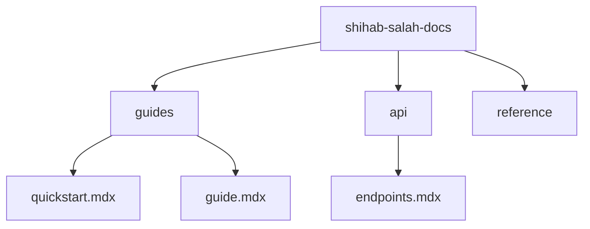

## Overview

Organize your project documentation effectively using Shihab Salah Documentation. Create structured hierarchies, edit content with version control, and collaborate seamlessly with your team. Follow these guides to maintain clear, up-to-date docs.

<Columns cols={3}>
  <Card title="Document Hierarchies" icon="folder" href="#creating-document-hierarchies">
    Build nested folder structures for intuitive navigation.
  </Card>
  <Card title="Editing & Versioning" icon="edit-3" href="#editing-and-versioning-content">
    Update content safely with automatic versioning.
  </Card>
  <Card title="Collaboration" icon="users" href="#collaboration-features">
    Share, review, and merge changes with teammates.
  </Card>
</Columns>

## Creating Document Hierarchies

Structure your documentation into logical folders and pages. Start with a root folder for your project, then nest subfolders for guides, APIs, and references.

<Steps>
  <Step title="Create Root Folder" icon="folder-plus">
    Navigate to your workspace dashboard. Click **New Folder** and name it after your project, such as `shihab-salah-docs`.
  </Step>
  <Step title="Add Subfolders" icon="folder">
    Inside the root, create subfolders like `guides/`, `api/`, and `reference/`. Drag and drop to reorder.
  </Step>
  <Step title="Add Pages" icon="file-plus">
    In each subfolder, create `.mdx` files. Use YAML frontmatter for metadata.

````mdx
```yaml
---
title: Quick Start Guide
description: Get started with Shihab Salah Documentation.
---
```
````
  </Step>
</Steps>



<Callout kind="tip">
  Use consistent naming like `kebab-case.mdx` for files to ensure clean URLs.
</Callout>

## Editing and Versioning Content

Edit pages directly in the visual editor or Markdown mode. Changes save automatically with Git-based versioning, so you track history and revert if needed.

<Tabs>
  <Tab title="Visual Editor" icon="edit">
    Select a page and click **Edit**. Use the WYSIWYG toolbar to add headings, lists, and components. Preview changes live.
  </Tab>
  <Tab title="Markdown Editor" icon="code">
    Switch to Markdown view for advanced control.

<CodeGroup tabs="MDX,YAML">
```mdx
## Welcome

Add your content here.

<Callout kind="info">This is a sample callout.</Callout>
```
```yaml
---
title: "API Reference"
description: "Detailed endpoint documentation."
tags: ["api", "reference"]
---
```
</CodeGroup>
  </Tab>
</Tabs>

View versions via the **History** panel. Compare diffs and restore previous states.

| Action          | Visual Editor | Markdown Editor |
|-----------------|---------------|-----------------|
| Quick Edits     | ✅ Fast       | 🔧 Precise     |
| Component Adds  | ✅ Drag-drop  | 📝 Syntax      |
| Version Control | Automatic    | Git commits    |

## Collaboration Features

Invite team members and manage permissions. Use comments, @mentions, and pull requests for reviews.

<ExpandableGroup>
  <Expandable title="Invite Collaborators" default-open="true">
    Go to **Settings > Team**. Add emails and set roles: **Viewer**, **Editor**, or **Admin**. Editors can propose changes via pull requests.
  </Expandable>
  <Expandable title="Review Changes">
    Receive notifications for @mentions and PRs. Approve merges to main branch. Resolve conflicts inline.
  </Expandable>
</ExpandableGroup>

<Steps>
  <Step title="Create Pull Request" icon="git-pull-request">
    Edit a page, then click **Create PR**. Add a description like "Fix typo in quickstart guide".
  </Step>
  <Step title="Merge and Deploy" icon="git-merge">
    Review comments, then merge. Pages update instantly with your brand color `#3B82F6`.
  </Step>
</Steps>

<Callout kind="success">
  Enable webhooks for Slack or Discord notifications on merges.
</Callout>