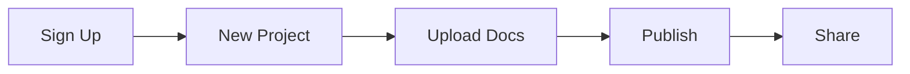

## Overview

Get started with Shihab Salah Documentation in minutes. This platform lets you create organized documentation spaces for your projects. Follow these steps to create an account, set up your first project, and upload documents.

<Callout kind="tip">
  You need a valid email address to sign up. Verify your account immediately to unlock full features.
</Callout>

## Prerequisites

Ensure you have:
- A modern web browser like Chrome or Firefox
- An email account for verification
- Optional: Node.js `{>=18.0.0}` for CLI tools

## Step-by-Step Setup

Use these numbered steps to launch your first documentation project.

<Steps>
  <Step title="Create Account" icon="user-plus">
    Visit the [sign-up page](https://shihabsalah-docs.com/signup) and enter your details.

    Choose your authentication method:

    <Tabs>
      <Tab title="Email" icon="mail">
        Enter your email and create a strong password. Confirm via the verification link sent to your inbox.
      </Tab>
      <Tab title="Google" icon="google">
        Click "Sign up with Google" and authorize the app. No password needed.
      </Tab>
      <Tab title="GitHub" icon="github">
        Authenticate with your GitHub account for seamless repo integration.
      </Tab>
    </Tabs>
  </Step>

  <Step title="Create Project" icon="folder-plus">
    From the dashboard, click "New Project". Name it `{my-first-docs}` and select a template.

    Configure initial settings:

    ```json
    {
      "name": "My First Docs",
      "brandColor": "#3B82F6",
      "theme": "default"
    }
    ```

    Save to generate your project space.
  </Step>

  <Step title="Upload Documents" icon="upload">
    Navigate to your project and use the upload interface.

    <CodeGroup tabs="Drag & Drop,CLI">
      ```bash
      # Drag files directly into the upload zone
      # Supports MDX, MD, images up to 10MB
      ```
      ```bash
      shihab-docs upload ./docs/*.mdx --project=my-first-docs
      ```
    </CodeGroup>

    Organize into folders like `{guides/}` and `{api/}` for better navigation.
  </Step>
</Steps>

## Next Steps

Explore key features to enhance your documentation.

<Columns cols={3}>
  <Card title="Add Navigation" icon="menu" href="/docs/navigation">
    Structure your sidebar with automated menus.
  </Card>
  <Card title="Customize Theme" icon="palette" href="/docs/theme">
    Match your brand with custom colors and logos.
  </Card>
  <Card title="Version Control" icon="git-branch" href="/docs/versions">
    Manage releases with Git integration.
  </Card>
</Columns>

## Quick Workflow



<Expandable title="Advanced: CLI Installation" default-open="false">
  Install the CLI for faster workflows:

  <Tabs>
    <Tab title="npm" icon="package">
      ```bash
      npm install -g @shihabsalah/docs-cli
      shihab-docs login
      ```
    </Tab>
    <Tab title="Homebrew" icon="apple">
      ```bash
      brew tap shihabsalah/docs
      brew install docs-cli
      ```
    </Tab>
  </Tabs>
</Expandable>

Your documentation space is now live. Share the generated URL with your team and start collaborating.